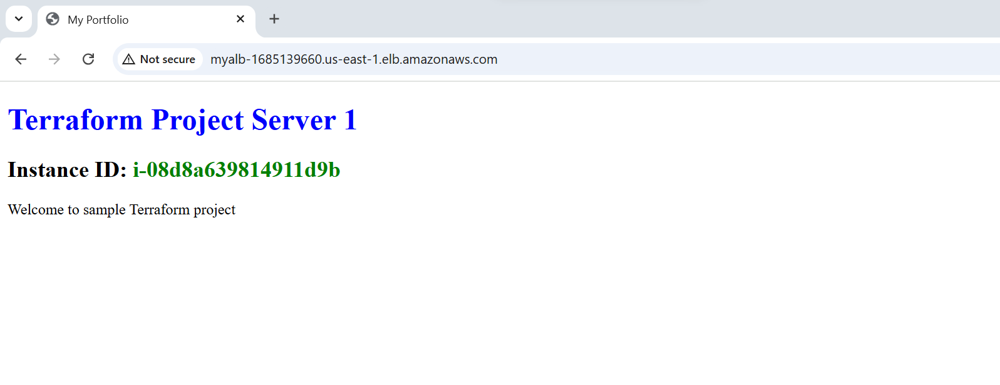

# Terraform project

This Terraform configuration is designed to provision a highly available and secure web application infrastructure on AWS. It leverages key AWS services, including a Virtual Private Cloud (VPC), EC2 instances, and an Application Load Balancer (ALB), to provide a scalable and fault-tolerant architecture.

The infrastructure includes the following key components:

### VPC and Networking:

A VPC with two public subnets, each in different Availability Zones, ensuring high availability.
An Internet Gateway and route tables to allow internet access for resources within the VPC.

### Security:

A security group configured to allow HTTP and SSH traffic while enabling outbound communication.

### Compute Resources:

An EC2 instance hosting a web server, initialized using a user-data script.

### Load Balancing:

An Application Load Balancer (ALB) that distributes incoming HTTP traffic across the EC2 instances, with health checks to ensure reliable service.

### Scalability and Accessibility:

The configuration supports future scalability by attaching additional instances to the ALB's target group.
Outputs the ALB's DNS name, providing a single access point for the application.
This setup is ideal for hosting web applications or services, offering flexibility, fault tolerance, and ease of management through Terraform.

## Run the Terraform Project

Navigate to Terraform project directory

``` terraform init ```

``` terraform plan ```

``` terraform apply ```

Below is the screenshot of application running



